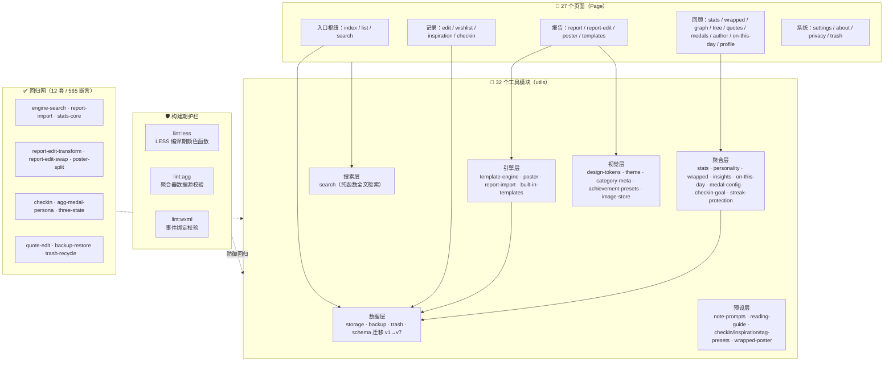
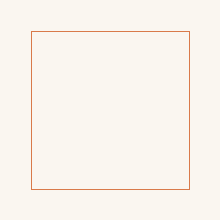

# 荧烛微光 · Glow in the Dark

> 一个**纯本地**的微信小程序，把你读过的书、走过的路、值得珍藏的日常，写成一份**文学化的叙事报告**。

<p align="center">
  
</p>

<p align="center">
  <em>"秉烛夜读，荧荧微光亦照亮一方天地。"</em>
</p>

<p align="center">
  
  
  
  
  
  
</p>

---

## 为什么做这个

市面上读书类应用大多把阅读量化成「读了多少本 / 多少页 / 多少分钟」。但这些数字抹掉了真正珍贵的东西——你在哪里读、和什么心境相伴、留下了哪句话、那段日子你是谁。

**荧烛微光** 把阅读（以及观影、技能学习、旅行、考试、每一个「第一次」）当作**值得珍藏的经历**，帮你把它们写成一份**有文学感的叙事报告**，而不只是一行统计数字。

> 📓 本项目的立项思考（市场调研、方向推演、产品简报）归档在 [`docs/research/`](docs/research/)，完整记录了从 0 到 1 的决策链。

## 核心闭环

```
记录  →  生成  →  编辑  →  导出分享
```

1. **记录** —— 录入一段经历：分类、评分、地点、心境、金句、自由标签、理解长文
2. **生成** —— 挑选几条 → 选模板 → 模板引擎自动代入变量生成多卡片叙事文案
3. **编辑** —— PPT 化编辑器：逐卡改文案、拖拽调序、段级富文本样式（字号 / 颜色 / 艺术字 / 旋转 / 倾斜 / 字间距 / 自由布局）
4. **导出** —— Canvas 绘制长图 / 单张海报，保存到相册，点对点分享

---

## 功能矩阵

| 模块 | 能做什么 |
|---|---|
| 🏆 **成就系统** | 多维度录入（分类 / 评分 / 地点 / 心境 / 金句 / 标签）；三态状态机（在读 / 完成 / 搁置）；成就墙 + 年份 / 分类 / 状态筛选 + 列表 / 网格 / 画廊三视图 |
| 📝 **报告生成** | 模板引擎（变量插值 / 条件块 / 循环块）；8 套内置模板；PPT 化编辑器；段落自由布局（拖位置 + 拖角改宽）；长图 / 单张导出 |
| 🎁 **年度回顾** | Spotify Wrapped 风五幕叙事；读者人格分析（8 类 / 4 维度纯算法）；稀有度模拟；可导出海报 |
| 📅 **每日打卡** | 多分类打卡；频率目标 / 完成率；Habit Score；连胜保护券（手动用券保住断档，Duolingo 语义） |
| ✨ **灵感 / 愿望** | 灵感抽屉（带搜索 + 日期筛选）；许愿星（想读什么 → 转化为成就） |
| 🗺️ **可视化回顾** | 养成树（静态垂直树）；关系图谱（同心环）；金句墙；作者聚合页；勋章墙；往年今日 |
| 🔍 **跨实体搜索** | 一次搜索覆盖成就 / 愿望 / 灵感 / 打卡 |
| 🗄️ **本地优先** | 数据仅存设备本地；JSON 备份 / 恢复；回收站（软删除 + 30 天清理）；数据迁移 v1 → v7 |

---

## 效果预览

> 📸 截图采集指引见 [`docs/SCREENSHOTS.md`](docs/SCREENSHOTS.md)。采集后把图片放进 `docs/screenshots/`，下方占位会自动渲染。

<p align="center">
  <em>（截图墙位置：报告编辑器 · 年度回顾 · 养成树 · 关系图谱 · 成就墙 · 每日打卡）</em>
</p>

<!-- 截图墙模板（采集后取消注释，替换文件名）-->
<!--
<table align="center">
  <tr>
    <td align="center"><br>报告编辑器</td>
    <td align="center"><br>年度回顾</td>
  </tr>
  <tr>
    <td align="center"><br>养成树</td>
    <td align="center"><br>关系图谱</td>
  </tr>
</table>
-->

---

## 架构



**数据流方向**：页面 → utils → storage（本地缓存）；聚合层只读已完成态数据（由 `lint:agg` 强制守护）；视觉层走 dual-render（WXSS 预览 ↔ Canvas 导出同源）。

---

## 双渲染同源架构（本项目最硬的设计）

报告编辑器有一个核心难点：**用户在预览里看到什么样，导出海报就必须长什么样**。但预览走 WXSS（浏览器渲染管线，1:1 比例），导出走 Canvas 2D（手工绘制，3:4 比例）——两套渲染引擎，比例都不一样。

我们的解法是**单一数据源 + 归一化坐标**：

```
SegmentStyle（数据）
  ├── 颜色 / 字号 / 对齐 / 艺术字     ──┐
  ├── rotate / skew / fontFamily /    ──┤  同一份样式
  │   letterSpacing（P9）              ──┤  两个渲染器各算各的
  └── boxX / boxY / boxW（P10）       ──┘
        ↓ 归一化小数 0~1
        ├─→ WXSS：百分比换算成 rpx 内联 style
        └─→ Canvas：小数 × 各自的正文区尺寸
```

任何新增视觉效果，都必须同时改两侧，并加 `test/report-edit-transform` 断言。详见 [`docs/dual-render.md`](docs/dual-render.md)。

---

## 快速开始

### 环境要求

- **微信开发者工具** 稳定版（最新）
- 基础库 ≥ 2.32.3

### 本地运行

1. 打开微信开发者工具
2. 导入项目，路径指向 `app/`
3. AppID 选「测试号」或填你自己的
4. 工具自动编译，模拟器查看效果

### 跑测试与 lint

```bash
cd app

# 三条构建期 lint（一次跑）
npm run lint

# 跑全部 12 套测试（需先各自 tsc 编译到 .tmp-build）
for d in test/*/; do
  [ -f "$d/tsconfig.json" ] && (cd "$d" && npx tsc -p tsconfig.json)
done
for d in test/*/; do
  [ -f "$d/run.ts" ] && node "$d/.tmp-build/test/${d%/}/run.js" | tail -1
done

# 全项目类型检查（只剩已知第三方声明错误）
npx tsc --noEmit
```

---

## 项目结构（精选）

```
app/
├── AGENTS.md              🤖 AI 协作约定（给开发者/AI 助手的开发纪律）
├── README.md              👋 本文件
├── docs/
│   ├── dual-render.md     📐 双渲染同源纪律详解
│   └── blog/              ✍️ 技术博客（见下）
└── miniprogram/
    ├── app.ts/json/less   入口
    ├── typings/           全局类型（CanvasRenderingContext2D 桩等）
    ├── components/
    │   └── navigation-bar/  WeUI 自定义导航栏（保留复用，不重写）
    ├── pages/             27 个页面
    └── utils/             32 个工具模块（按职责分层数据/引擎/聚合/视觉/预设/搜索）
```

> 🤖 **关于 `AGENTS.md`**：本项目的开发约定单独维护在 `AGENTS.md` 里，它面向 AI 编程助手（含字段纪律、API 白名单、canvas 硬规则、合规边界）。这种「把开发约定显式化、机器可读」的实践本身就是本项目的一个亮点。

---

## 工程亮点（写进简历也成立）

| 亮点 | 价值 |
|---|---|
| **三条构建期 lint** | 每条都源自一次真实线上 bug（LESS `fade()` 真机白屏、聚合器误吃在读态、wxml 静默失效），不是为 lint 而 lint |
| **12 套测试 / 565 断言** | 纯 Node 跑、零依赖；覆盖模板引擎、canvas 拆卡、人格算法、备份恢复等核心路径 |
| **数据迁移机制** | `schema_version` + `migrateIfNeeded`，v1 → v7 七次迭代零数据丢失 |
| **双渲染同源** | 归一化小数坐标解决预览 1:1 ↔ 导出 3:4 比例差，所见即所得 |
| **设计令牌单一真相源** | 配色 / 字号 / 主题改一处全应用跟随；canvas 与 CSS 同源；双主题（light/dark） |
| **合规边界驱动架构** | 不调 AI、不抓豆瓣、数据纯本地——约束本身倒逼出了模板引擎这套自研方案 |
| **ES2019 钉死** | 真机旧基础库不支持可选链；全项目禁用 `?.` / `??`，平台兼容实战 |

---

## 合规边界（个人主体，提审必读）

✅ **允许**

- 用户自己录入数据存本地
- 用户自己生成报告并保存相册（点对点分享，非平台 UGC）
- 统计用户自己的数据

❌ **禁止**（任何一条触发都会被审核拒）

- 用户之间互相看到对方数据
- 书籍 / 影视资源播放或下载
- 调用 AI 大模型生成文案（触发「深度合成」类目；所有文案靠模板拼装 + 用户手填）
- 抓取豆瓣等内容平台数据
- 任何形式的电商 / 付费 / 广告

**判断原则**：所有数据都是「用户自己的 + 本地的」。

---

## 技术博客

深入讲本项目最难的部分：

- 📝 **[《微信小程序 Canvas 与 WXSS 双渲染一致性的工程实践》](docs/blog/dual-render.md)** —— 为什么预览和导出会不一致、归一化坐标怎么解决问题、dual-render 纪律如何防御回归。

---

## 体验小程序

<p align="center">
  
  <br>
  <em>扫码体验「荧烛微光」</em>
</p>

> 📌 上线后会替换为真实二维码。当前可在微信开发者工具中用「导入项目 → 测试号」直接体验完整功能。

---

## 常见问题

**Q: 数据存哪里？会被上传吗？**
A: 全部存在用户设备本地（`wx.setStorageSync`），不上传任何服务器。

**Q: 卸载小程序会丢数据吗？**
A: 会。建议定期在「设置 → 备份」导出 JSON 到剪贴板保存。

**Q: 报告保存到相册失败？**
A: 多半是拒绝过相册权限。`pages/poster/poster.ts` 里有引导去设置的逻辑（`showSettingGuide`）。

**Q: 为什么不用云开发 / AI 生成文案？**
A: 个人主体 + 合规限制。云开发引入登录和数据上传，AI 生成触发「深度合成」类目，都会触线。

**Q: 这个项目和「读书打卡」类应用有什么本质区别？**
A: 打卡类应用回答「读了多少」，本应用回答「读成了什么」——把经历写成叙事，而不是堆数字。

---

## 开发约定

详见 [`AGENTS.md`](AGENTS.md)。要点速览：

1. 数据层统一走 `utils/storage.ts`
2. 聚合计算走 `utils/*.ts` 纯函数（且默认只读已完成态）
3. 模板占位符替换走 `utils/template-engine.ts`
4. 卡片绘制走 `utils/poster.ts`，dpr 由调用方处理
5. 配色改 `design-tokens.ts` 与 `app.less` 顶部变量，禁止硬编码 hex
6. Canvas 严守 dpr 纪律：`canvas.width = cssW * dpr` + `ctx.scale(dpr, dpr)`
7. 样式用 LESS，单位用 rpx
8. 不用 `?.` / `??`（ES2019 钉死）

---

## License

MIT © 荧烛微光
